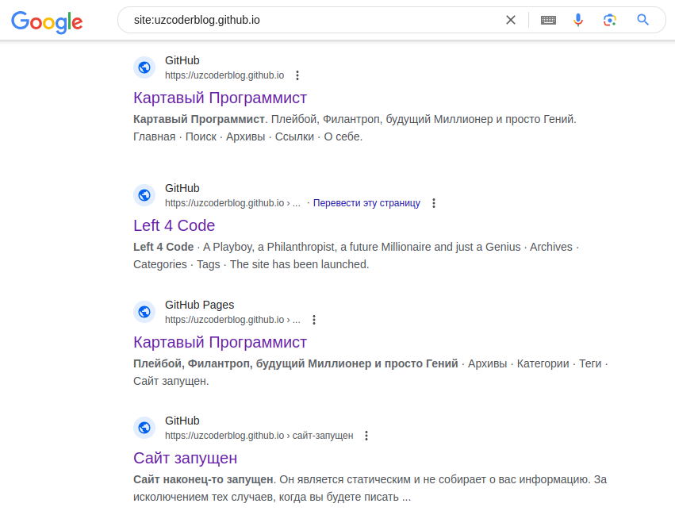

+++
author = "Ayder Nurmuhammedov"
title = "The site is now in the search for Yandex and Google"
date = '2024-10-19'
description = "I was finally able to display my site in Google and Yandex search"
categories = [
    "About Blog"
]
tags = [
    "About Blog",
]
image = "2024-10-19_1.png"
+++

Hello from sunny Uzbekistan, friends.
 
I finally managed to get my website indexed in Yandex and Google search. It was an interesting experience. Considering that I didn't spend a dime on the site or hosting. Even getting it indexed by search engines went without a hitch.
 
In the next post on the website and in a video on my Youtube channels, I will explain how to do this. Anyone interested can handle it. For beginners learning website layout, this will be perfect.
 
By the way, if you want to get active site pages indexed, just type in <b>site:uzcoderblog.github.io</b>

| Yandex pics                         | Google pics                            |
| ----------------------------------- | ----------------------------------- |
|  |  |




