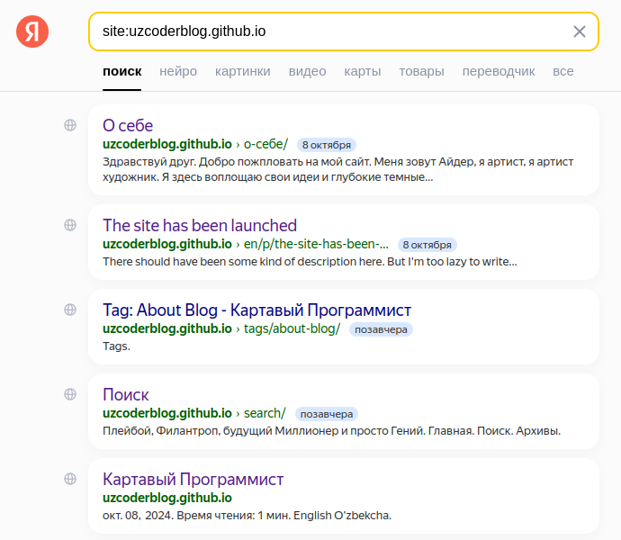
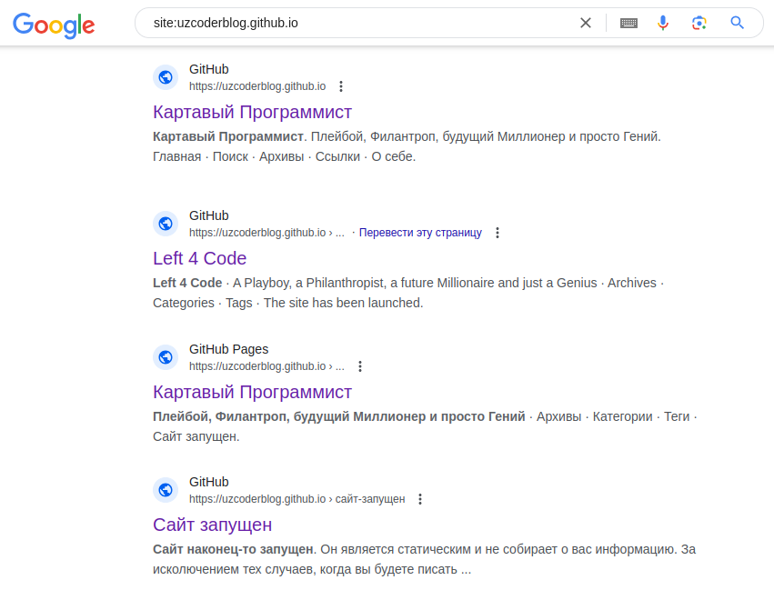

+++
author = "Ayder Nurmuhammedov"
title = "Сайт теперь в поиске Яндекс и Google"
date = '2024-10-19'
description = "Я наконец-то смог вывести свой сайт в поиске Google и Яндекса"
categories = [
    "About Blog"
]
tags = [
    "About Blog",
]
image = "2024-10-19_1.png"
+++

Привет из солнечного Узбекистана друзья.
 
Я наконец-то смог вывести свой сайт в поиске Яндекса и Google. Это был интересный опыт. Учитывая, что я не вкладывал ни копейки ни на сайт, ни на хостинг. Даже вывод в поисковиках обошлось без проблем.
 
В следующем посте на сайте и в видео на Youtube каналах, я объясню как это сделать. С этим справится любой желающий. Для новичков изучающих верстку сайтов, это будет самое то.
 
Кстати, если вы хотите вывести действующие страницы сайта в поиск, то введите туда  <b>site:uzcoderblog.github.io</b>

| Yandex pics                         | Google pics                            |
| ----------------------------------- | ----------------------------------- |
|  |  |




